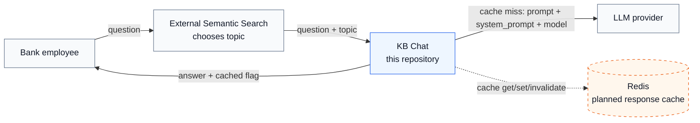
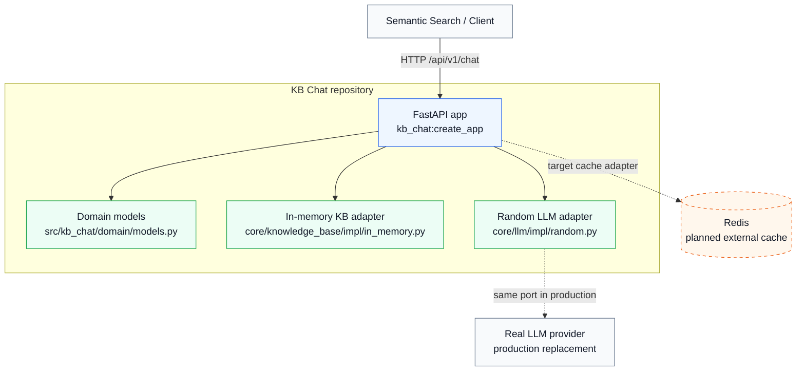
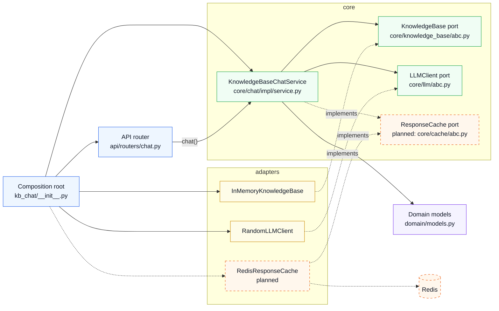
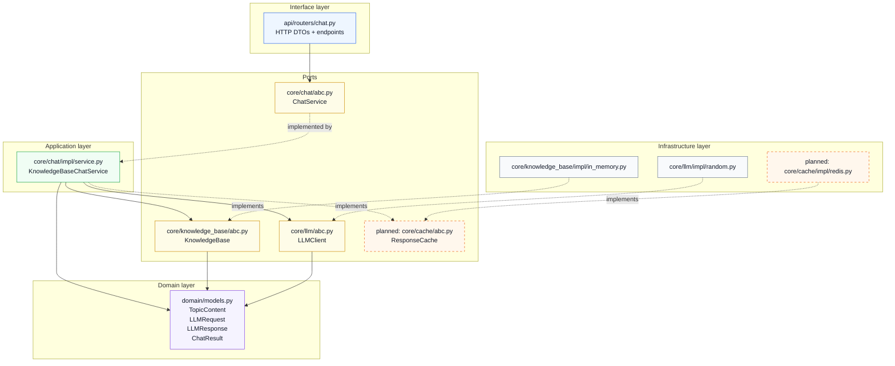
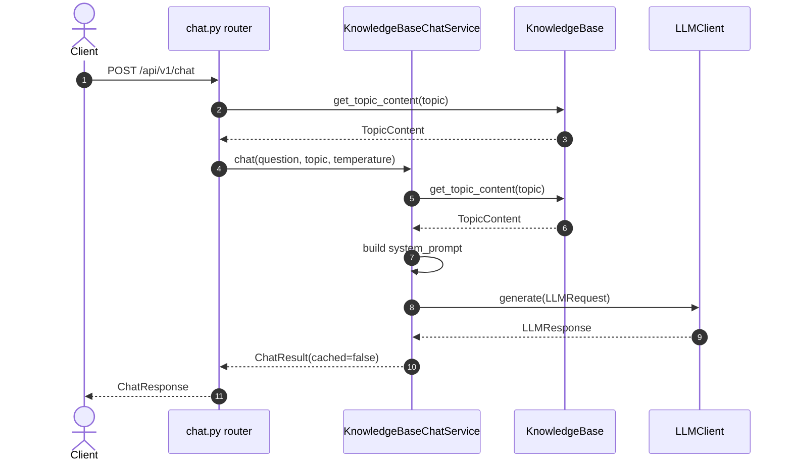
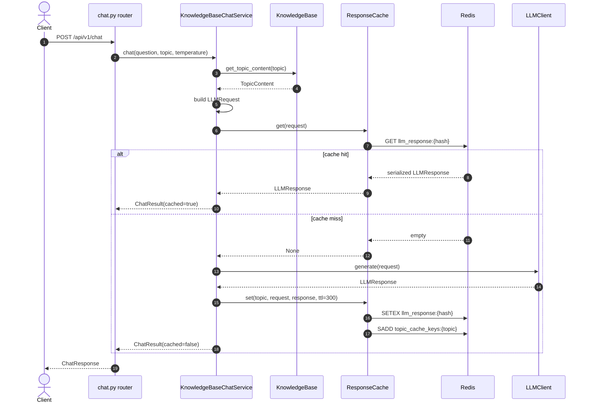
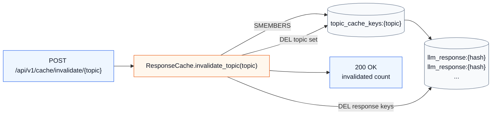

# KB Chat: C4 + DDD Diagrams

Документ показывает архитектуру без смешивания уровней:

- C4 L1: кто вокруг системы.
- C4 L2: какие контейнеры/процессы участвуют.
- C4 L3: какие компоненты есть внутри Python-приложения.
- DDD/code view: где в коде API, use case, domain, ports и adapters.
- Target cache flow: куда встраивать Redis-кэш из `TASK.md`.

Обозначения:

- Сплошные связи - текущий код.
- Пунктирные связи - целевая доработка для Redis cache.

## C4 L1: System Context

Один запрос идет от сотрудника через внешний semantic search в этот сервис. Redis нужен только для ускорения повторных LLM-ответов.

## C4 L2: Containers

В этом репозитории фактически один runtime-контейнер: FastAPI-приложение. Knowledge base и Random LLM сейчас являются Python-адаптерами внутри процесса, а Redis будет внешним контейнером.

## C4 L3: Components Inside FastAPI App

Это главный уровень для понимания текущего кода. `chat.py` не должен знать про Redis напрямую: он вызывает use case. Use case зависит от портов, а реализации портов подключаются в composition root.

## DDD Code View

Здесь не классы ради классов, а смысловые роли файлов.

## Current Request Flow

Текущий код дважды ходит в `KnowledgeBase`: сначала router проверяет topic, потом service снова загружает topic для system prompt.

## Target Request Flow With Redis Cache

Кэш должен находиться вокруг вызова LLM внутри `KnowledgeBaseChatService`: сначала строим тот же `LLMRequest`, потом проверяем Redis по ключу из `prompt + system_prompt + model`.

## Target Cache Invalidation

Для удаления по topic Redis-адаптеру нужен индекс `topic -> response keys`.

## What To Add For The Redis Task

Минимальный чистый DDD вариант:

1. `core/cache/abc.py` - порт `ResponseCache`.
2. `core/cache/impl/redis.py` - Redis-адаптер.
3. `KnowledgeBaseChatService(..., response_cache: ResponseCache | None = None)` - optional dependency для тестов и простого запуска.
4. `POST /api/v1/cache/invalidate/{topic}` - endpoint вызывает cache port, не Redis напрямую.
5. Cache key строится из `prompt`, `system_prompt`, `model`.
6. Кэшируются только успешные `LLMResponse`.
